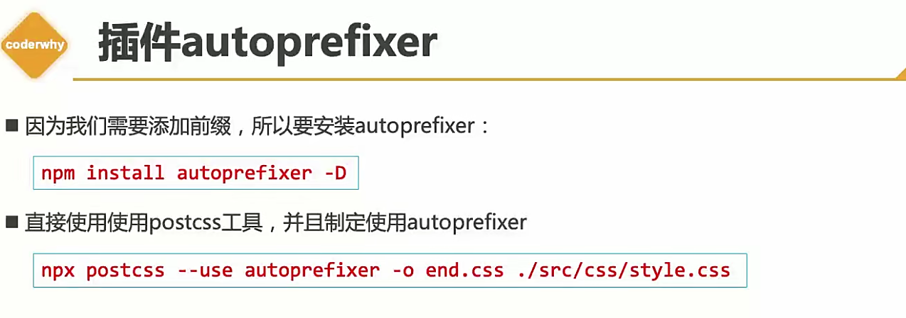

# webpack使用
## 1. 基础

### 局部安装

```bash
npm init -y && npm i webpack webpack-cli -D
```

在package.json文件中加入一条命令

```javascript
"build": "npx webpack --entry .src/main.js --output-path ./build"
```

```javascript
源代码
class Student {
  constructor(name, age, subject) {
    this.name = name;
    this.age = age;
    this.subject = subject;
  }

  study(){
    console.log('我在学习' + this.subject);
  }
}

let student3 = new Student('阿辉', 24, '前端开发');
student3.study();
// 打包之后
new class{constructor(s,t,c){this.name=s,this.age=t,this.subject=c}study(){console.log("我在学习"+this.subject)}}("阿辉",24,"前端开发").study();
```

### Webpack配置打包

创建webpack.config.js作为webpack打包的配置文件

```javascript
const path = require('path'); //引入path包
module.exports = {
    // 入口文件
  entry: './src/main.js',
    // 出口模块
  output: {
    path: path.resolve(__dirname, 'dist'),//2.修改output对象的path属性改为绝对路径
     // 打包后的名称
    filename: 'bundle.js'
  }
}
```

```javascript
// main.js
const priceFormat = function(){
 return '909.213'
}

module.exports = {
  priceFormat
}

// math.js
export function sum(num1, num2) {
  return num1 + num2
}

// index.js
import { sum } from './js/math.js'
const { priceFormat } = require('./js/main.js')
console.log(sum(1, 2))
console.log(priceFormat)
```

webpack可以同时将commonJS规范和ES6模块化规范一起打包最终可以被index.html直接使用。强的没边

### CSS打包

Webpack并不能直接打包CSS文件，需要借助各种插件使用其他特殊功能。

```bash
npm i css-loader -D
```

再打包还是不能显示样式,还需要style-loader

```javascript
npm i style-loader -D
```

```javascript
const path = require('path') //引入path包
module.exports = {
  entry: './src/index.js',
  output: {
    path: path.resolve(__dirname, 'dist'), //2.修改output对象的path属性改为绝对路径
    filename: 'bundle.js',
  },
  mode: 'production',
  module: {
    rules: [
      {
        test: /\.css$/, // 正则表达式匹配
        // 指定打包的loader, 数组表示多个
        // 简单写法loader: "css-loader"
        // 完整写法
        use: [
            // loader顺序由下到上
            { loader: 'style-loader' },
            { loader: 'css-loader' }
        ],
      },
    ],
  },
}
```

### Sass，Less打包

打包处理less文件
运行 npm i less-loader less -D 命令
在webpack.config.js 的module -> rules 数组中,添加loader

```javascript
module.exports = {
    module:{
    rules:[{
        test:/\.less$/,
        use:[
            'style-loader',
            'css-loader',
            'less-loader'
            ]
        }]
    }
}
```

打包处理sass文件
运行 npm i sass-loader dart-sass -D 命令
在webpack.config.js 的module -> rules 数组中,添加loader

```javascript
module.exports = {
    module:{
        rules:[{
                    test:/\.sass$/,
                    use:[
                        'style-loader',
                        'css-loader',
                        'sass-loader'
                    ]
            }]
    }
}
```

### PostCSS

postcss是CSS各种CSS的预处理，autoprefixer是基于postcss的浏览器兼容前缀的插件



```javascript
npx postcss --use autoprefixer -o end.css .\src\css\test2.css
// test2.css
.title {
  user-select: none;
}

// 打包之后可以看到打包之后成了兼容微软、webkit、火狐浏览器的CSS样式
.title {
  -webkit-user-select: none;
     -moz-user-select: none;
      -ms-user-select: none;
          user-select: none;
}

/*# sourceMappingURL=data:application/json;base64,eyJ2ZXJzaW9uIjozLCJzb3VyY2VzIjpbInNyYy9jc3MvdGVzdDIuY3NzIl0sIm5hbWVzIjpbXSwibWFwcGluZ3MiOiJBQUFBO0VBQ0UseUJBQWlCO0tBQWpCLHNCQUFpQjtNQUFqQixxQkFBaUI7VUFBakIsaUJBQWlCO0FBQ25CIiwiZmlsZSI6ImVuZC5jc3MiLCJzb3VyY2VzQ29udGVudCI6WyIudGl0bGUge1xyXG4gIHVzZXItc2VsZWN0OiBub25lO1xyXG59XHJcbiJdfQ== */
```

### postcss-preset-env

事实上，在配置 `postcss-loader` 时，我们配置插件并不需要使用 `autoprefixer`。

我们可以使用另外一个插件：`postcss-preset-env`

-   `postcss-preset-env` 也是一个 `postcss` 的插件；
-   它可以帮助我们将一些现代的 `CSS` 特性，转成大多数浏览器认识的 `CSS`，并且会根据目标浏览器或运行时环境添加所需的 `polyfill`；
-   也包括会自动帮助我们添加 `autoprefixer`（所以相当于已经内置了 `autoprefixer`）；

```css
 color: #12345678; // 解析rgba
```

### 图片资源打包

```bash
npm i file-loader -D
```

```javascript
{
    test: /\.(png|jpe?g|gif|svg)$/,
    use: {
      loader: 'file-loader',
      options: {\
        // 设置载入文件名
        name: 'img/[name].[hash:4].[ext]', //img文件夹源文件名+hash.扩展名
      },
    },
},
```

## 2.插件

插件是 webpack 的[支柱](https://github.com/webpack/tapable)功能。webpack 自身也是构建于，你在 webpack 配置中用到的**相同的插件系统**之上！插件目的在于解决 [loader](https://www.webpackjs.com/concepts/loaders) 无法实现的**其他事**。

#### clean-webpack-plugin

clean-webpack-plugin是一个清除文件的插件。在每次打包后，磁盘空间会存有打包后的资源，在再次打包的时候，我们需要先把本地已有的打包后的资源清空，来减少它们对磁盘空间的占用。插件clean-webpack-plugin就可以帮我们做这个事情。

```javascript
const { CleanWebpackConfig } = require('clean-webpack-plugin')
// 添加一条plugins
plugins: [new CleanWebpackConfig()]
```

#### html-webpack-plugin 

这个插件用来简化创建服务于 webpack bundle 的 HTML 文件，尤其是对于在文件名中包含了 hash 值，而这个值在每次编译的时候都发生变化的情况。你既可以让这个插件来帮助你自动生成 HTML 文件，也可以使用 lodash 模板加载生成的 bundles，或者自己加载这些 bundles

```javascript
const {HtmlWebpackPlugin} = require('html-webpack-plugin')
// 添加一条plugins
plugins: [new HtmlWebpackPlugin()]

// 默认模板
<!doctype html><html><head><meta charset="utf-8"><title>Webpack App</title><meta name="viewport" content="width=device-width,initial-scale=1"><script defer="defer" src="./dist/bundle.js"></script></head><body></body></html>

// 配置HTML模板
plugins: [
    new HtmlWebpackPlugin({
      title: 'My App',
      filename: 'assets/admin.html'
    })
]
```

